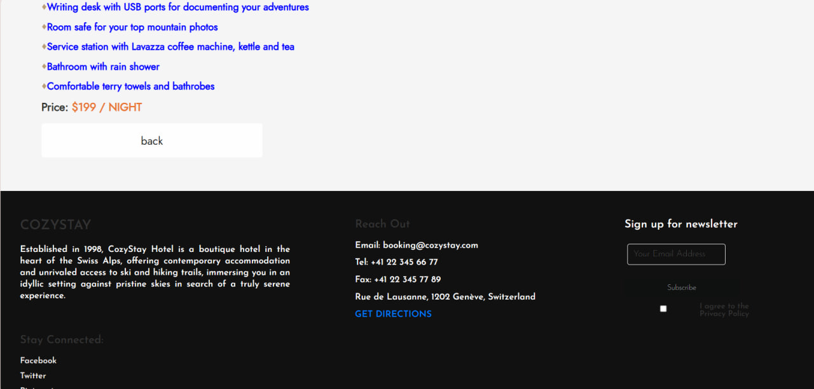

# Booking Hotel - Getting Started

This project, Booking Hotel, is a React-based web application created using Create React App. Below are the available scripts and instructions to get you started with the development environment.

## Available Scripts

In the project directory, you can run:

### `npm start`

Runs the app in the development mode.
Open [http://localhost:3000](http://localhost:3000) to view it in your browser.

The page will reload when you make changes.
You may also see any lint errors in the console.

### `npm test`

Launches the test runner in the interactive watch mode.
See the section about running tests for more information.

### `npm run build`

Builds the app for production to the `build` folder.
It correctly bundles React in production mode and optimizes the build for the best performance.

The build is minified, and the filenames include the hashes.
Your app is ready to be deployed!

See the section about deployment for more information.

### `npm run eject`

**Note:** This is a one-way operation. Once you eject, you can't go back!

If you aren't satisfied with the build tool and configuration choices, you can eject at any time. This command will remove the single build dependency from your project.

Instead, it will copy all the configuration files and the transitive dependencies (Webpack, Babel, ESLint, etc.) right into your project so you have full control over them. All of the commands except eject will still work, but they will point to the copied scripts so you can tweak them. At this point, you're on your own.

You don't have to ever use eject. The curated feature set is suitable for small and middle deployments, and you shouldn't feel obligated to use this feature. However, we understand that this tool wouldn't be useful if you couldn't customize it when you are ready for it.

## Learn More

You can learn more about Create React App in the [Create React App documentation](https://create-react-app.dev/).

To learn React, check out the [React documentation](https://reactjs.org/).

## Integration with Booking Hotel

For integrating the provided documentation with the Booking Hotel project, please refer to the respective sections in the Create React App documentation:

- [Code Splitting](https://create-react-app.dev/docs/code-splitting)
- [Analyzing the Bundle Size](https://create-react-app.dev/docs/analyzing-the-bundle-size)
- [Making a Progressive Web App](https://create-react-app.dev/docs/making-a-progressive-web-app)
- [Advanced Configuration](https://create-react-app.dev/docs/advanced-configuration)
- [Deployment](https://create-react-app.dev/docs/deployment)
- [Troubleshooting](https://create-react-app.dev/docs/troubleshooting#npm-run-build-fails-to-minify)

## Project Overview

Our project, Booking Hotel, is built with React and Firebase, providing the following functionalities:

1. **Authentication via Firebase:**
    - Users can sign up, log in, and manage their authentication state through Firebase.

2. **Payment Email Notifications:**
    - When booking a room, users receive payment email notifications.

3. **Booking Form:**
    - The application includes a booking form with a calendar and person counter.

4. **Search and Filter:**
    - Users can search for accommodations and filter results by name.

5. **Profile Management:**
    - Users can change their profile information, such as their name, and the changes are saved.

## Pages

The application consists of four main pages:

1. **Home:**
    - Overview of the application and available accommodations.
       
       
       
       
       

2. **Stay:**
    - Details and booking options for individual accommodations.
       
       
       
       

3. **About:**
    - Information about the application and its purpose.
       
       
       
       

4. **Personal Profile:**
    - A page where users can manage their profile information and view their reservations.
      
      

## Additional Features

- **Google Maps Integration:**
    - The application incorporates Google Maps to determine the user's geolocation.

- **Room Reservation:**
    - When reserving a room, the room is deleted from the room list and shown in the personal profile page.
      

- **Progressive Web App (PWA):**
    - The project is configured as a Progressive Web App, featuring an installable icon, caching with a service worker for offline access.

## Room Details

- **More Information:**
    - Detailed information about each room is available inside the application.
      
      

## Deployment

The application is hosted on Netlify for free.

Visit the live site: [https://www.netlify.com/]
https://marvelous-twilight-8c97f7.netlify.app/

## Troubleshooting

If you encounter issues with `npm run build` failing to minify, please refer to the [Troubleshooting section](https://create-react-app.dev/docs/troubleshooting#npm-run-build-fails-to-minify) in the Create React App documentation.

Happy coding with Booking Hotel!
